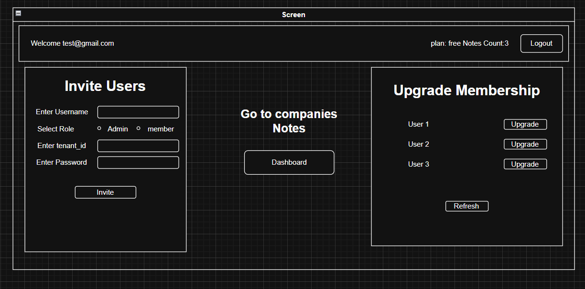
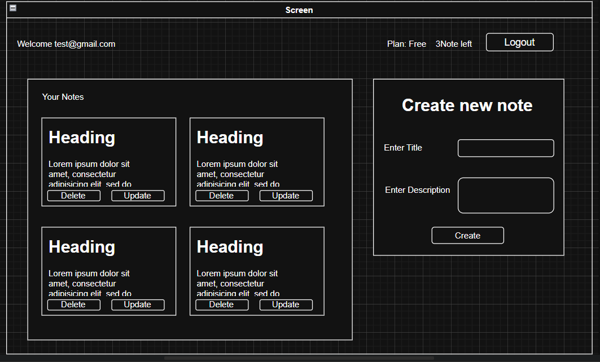

# Multi-Tenant SaaS Notes Application

A **multi-tenant Notes application** that allows multiple companies (tenants) to securely manage their users and notes, with **role-based access control** and **subscription limits**. Built with **Node.js, Express, MongoDB Atlas, HTML, CSS, and JavaScript**, and hosted on **Vercel**.

---

## 🔹 Features

### Multi-Tenancy

* Supports **two tenants**: Acme and Globex.
* Data is isolated using a **shared schema** with `tenant_id` — one tenant’s data cannot be accessed by another.

### Authentication & Authorization

* **JWT-based login**.
* **Roles**:

  * **Admin** → Can invite users and upgrade subscriptions.
  * **Member** → Can create, view, edit, and delete notes.
* Mandatory test accounts:

  ```
  username:admin@acme.test, password:password
  username:user@acme.test, password:password
  username:admin@globex.test, password:password
  username:user@globex.test, password:password

  ```

### Subscription & Feature Limits

* **Free Plan** → Max **3 notes per tenant**.
* **Pro Plan** → Unlimited notes.
* Admin can upgrade subscription via:

  ```
  POST /premium/:id
  ```

### Notes API (CRUD)

* **Create Note:** `POST /notes`
* **List Notes:** `GET /notes`
* **Update Note:** `PUT /notes/:id`
* **Delete Note:** `DELETE /notes/:id`

> API ensures **tenant isolation** and **role-based access control**.
> `POST` and `PUT` endpoints use the **request body** to send note data.

### Mailing Function

* **Send email notifications** to users (e.g., invitations, subscription upgrades).
* Backend uses **NodeMailer** or similar service.
* Admin can send invites via endpoint:

  ```
  POST /invite
  ```

  Payload example:

  ```json
  {
    "email": "user@example.com",
    "tenant": "Acme",
    "role": "Member"
  }
  ```
* Emails are sent automatically with user details and login instructions.

### Frontend

* Minimal **HTML, CSS, JavaScript** interface.
* Supports:

  * Login with predefined accounts
  * List, create, delete, and update notes
  * Display **“Upgrade to Pro”** message when Free plan limit is reached

---

## 🔹 Architecture & Design

* **Backend:** Node.js + Express
* **Database:** MongoDB Atlas (shared schema with `tenant_id`)
* **Frontend:** HTML, CSS, JS
* **Hosting:** Vercel (frontend + backend)
* **CORS:** Enabled to allow frontend-backend communication

### Role-Based Middleware

* JWT token contains **role** and **tenant info**.
* Middleware protects routes:

  * Members can access **note CRUD routes**.
  * Admins can access **all member routes + invite & upgrade endpoints**.

### Subscription Logic

* Free plan limited to 3 notes per tenant.
* Upgrade endpoint removes note limit for all tenant users.

### Mailing Logic

* Email system integrated for **Admin notifications** and **user invites**.
* Backend triggers email after:

  * User invitation
  * Tenant subscription upgrade
  * Optional alerts for important notes

---

## 🔹 Challenges & Solutions

| Problem                                      | Solution                                                                                                              |
| -------------------------------------------- | --------------------------------------------------------------------------------------------------------------------- |
| Updating database data via UI                | Used `contenteditable` for notes; enabled update button on change; sent updated title/content via `data-id` attribute |
| CORS errors                                  | Enabled CORS on server with correct origins                                                                           |
| MIME type errors                             | Ensured correct `Content-Type` and static file serving paths                                                          |
| Getting updated data for all notes           | Implemented frontend JS to detect changes and update via API                                                          |
| Vercel dependency issues                     | Installed all required dependencies and configured `package.json`                                                     |
| Cookies from Vercel backend to local machine | Configured proper CORS & credentials in fetch                                                                         |
| MongoDB Atlas errors (IP whitelist)          | Added all required IPs in Atlas cluster whitelist                                                                     |
| Mailing integration                          | Configured NodeMailer with backend routes for invites and notifications                                               |

---

## 🔹 How to Run Locally

1. Clone the repo:

```bash
git clone repo_url
cd <repo-folder>
```

2. Install dependencies:

```bash
npm install
```

3. Create `.env` file with:

```
MONGO_URI_LOCAL=<Your MongoDB local URI>
MONGO_URI=<Your MongoDB Atlas URI>
PORT=5000
JWT_SECRET="X9$wR2!nF7@dG5#qP8^mY6&tK3*oV1+zJ0%LhC4=E_AZ-B(M)U~N^T#S&Q*R"
GMAIL_API_KEY=<Your email password 16 char key app.google>
EMAIL_FROM=<Your email address>

```

4. Start the server:

```bash
npm start
```

5. Access frontend at:

```
http://localhost:5000

```
6. Access frontend at:

```
Remove comment in app.js so app can listan port
```

---

## 🔹 Deployment

* Both **frontend and backend hosted on Vercel**.
* Link **[Draw.io](notes-saas-app-omega.vercel.app)**
* Backend supports **CORS** for API calls from frontend.
* Health endpoint:

```
GET /health → { "status": "ok" }
```

---

## 🔹 API Endpoints

| Method | Endpoint                 | Description                  | Role         |
| ------ | ------------------------ | ---------------------------- | ------------ |
| POST   | `/login`                 | Authenticate user            | All          |
| GET    | `/notes`                 | List all notes (tenant only) | Admin/Member |
| GET    | `/notes/:id`             | Get a specific note          | Admin/Member |
| PUT    | `/notes/update`          | Update a note                | Admin/Member |
| DELETE | `/notes/remove`          | Delete a note                | Admin/Member |
| POST   | `admin/premium/:id`      | Upgrade tenant to Pro        | Admin only   |
| POST   | `/admin/invite`          | Send user invitation email   | Admin only   |
| GET    | `/health`                | Health check                 | protected    |

---

## 🔹 Design (Draw.io)

> Attach your Draw.io designs/screenshots here to visualize **UI designs**.
* Link [Draw.io](https://drive.google.com/drive/folders/1yD3Bd7sv_FOVAZmaDY6E5oUVlBI-1PwP?usp=drive_link)
* 
* 

---

## 🔹 Notes

* Admin can perform **all Member actions** + special powers.
* All APIs enforce **tenant isolation**.
* Subscription upgrade is **tenant-wide**, affecting all users.
* Mailing system included for invitations and notifications.
* Frontend uses **vanilla JS**, not fully React.

---

## 🔹 Future Improvements

* Add **React frontend** for better UI/UX.
* Implement **real-time updates** using WebSockets.
* Add **audit logs** for Admins.
* Expand mailing system for automated alerts and reminders.

---

## 🔹 Contact

* Developer: **Tejas Dhangar**
* Email: **[Tejas Dhangar](mailto:dhangartejas123@gmail.com)**
